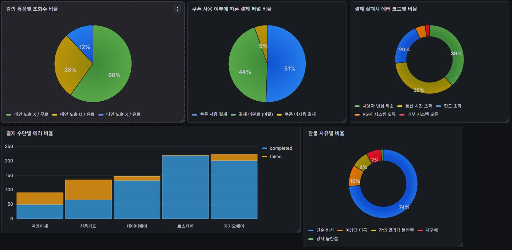

# 📊 LiveKlass Event Log Pipeline

<p align="left">
  
  
  
  
</p>

## 📝 0. 프로젝트 소개 
본 프로젝트는 플랫폼/데이터 엔지니어링 인턴 채용 과제로, 웹 서비스 유저의 행동(조회, 구매, 환불 등)을 기록하고 분석하는 경량 데이터 파이프라인입니다. 

**[Pipeline Architecture]**
> `Event Generator (Python/FSM)` ➡️ `Log Storage (MySQL)` ➡️ `Data Visualization (Grafana BI)`

### 📁 프로젝트 구조 
프로젝트의 관심사 분리를 위해 핵심 로직(`app`), 인프라 설정(`infrastructure`), 관리 스크립트(`scripts`)로 계층화하였습니다.
```text
liveKlass_test/
├── app/                              # 핵심 애플리케이션 로직
│   ├── core/                         # 설정 및 공통 상수
│   │   ├── config.py
│   │   └── constants.py
│   ├── db/                           # 데이터베이스 연결 및 모델 정의
│   │   ├── database.py
│   │   └── models.py
│   ├── services/                     # 비즈니스 로직 및 데이터 처리
│   │   ├── fsm.py                    # 상태 머신 로직
│   │   ├── generators.py             # 데이터 생성 로직
│   │   └── analyze.py                # 데이터 분석 로직
│   └── main.py                       # 애플리케이션 실행 진입점 (Entry Point)
├── infrastructure/                   # 인프라 설정 및 모니터링
│   ├── sql/
│   │   ├── init.sql                  # 데이터베이스 DDL/초기 설정
│   │   └── visualize.sql             # Grafana BI용 쿼리
│   └── grafana/
│       └── dashboard_backup.json     # Grafana 대시보드 백업
├── scripts/                          # 유틸리티 및 관리 스크립트
│   ├── reset_db.py                   # DB 초기화 스크립트
│   └── setup.bat                     # 로컬 환경 세팅 스크립트
├── .env                              # 환경 변수 (Git 제외)
├── .gitignore                        # Git 추적 제외 목록
├── docker-compose.yml                # Docker 컨테이너 오케스트레이션
└── requirements.txt                  # Python 패키지 의존성 목록
```

### 📈 SQL 집계 결과 시각화 


---

## 🚀 1. 실행 방법

이 프로젝트는 배치 스크립트를 통해 가상환경 구성, DB 세팅, 초기 데이터 생성을 한 번에 처리합니다.

### 1-1. 사전 요구 사항
- Python 3.8 이상
- Docker 및 Docker Compose 가동 중

### 1-2. 실행 명령어

**Step 1. 파이프라인 자동 실행(이벤트 생성 -> 저장)**

프로젝트 최상위 디렉터리에서 아래 스크립트를 실행합니다.
```bash
setup.bat
```
> **진행 과정:** 가상환경 생성 및 의존성 설치 → DB/Grafana 컨테이너 실행 → 메인 로직(`app/main.py`) 자동 실행

**Step 2. Grafana 시각화 환경 세팅**
1. **접속**: 웹 브라우저에서 http://localhost:3000 접속 (계정: admin / admin)
2. **데이터 소스 연결**: Connections ➡️ Data sources ➡️ [Add data source] ➡️ MySQL 선택
   - 설정 정보: `Host URL: mysql:3306` | `Database: liveclass_logs` | `User/Pass: root/root`
   - 하단의 `[Save & test]`를 클릭하여 연결을 확인합니다.
3. **대시보드 Import**: Dashboards ➡️ New ➡️ Import 클릭
4. `infrastructure/grafana/dashboard_backup.json` 업로드 후 데이터 소스 선택하여 `[Import]`
   
> 데이터 소스 연결 직후 패널에 데이터가 즉시 로드되지 않을 수 있습니다. 
> 이 경우, 각 패널의 **Edit ➡️ [Run query]**를 클릭해주세요.

## 🏗️ 2. 저장소 선정 및 설계

### 2-1. Log Storage: MySQL

- **선정 이유 (명확한 스키마 구조화):** 단순 파일 저장이 아닌 '필드를 명확히 분리'하라는 요구사항을 충족하기 위해, 정형화된 스키마를 강제할 수 있는 RDBMS를 선택했습니다.

### 2-2. 스키마 설명

- 단일 테이블에 모든 로그를 혼합하면 불필요한 Null 값이 많아지고 쿼리 성능이 저하됩니다. 따라서 트래픽, 결제 퍼널, 환불이라는 비즈니스 도메인별로 테이블을 물리적으로 분리하여 관심사를 명확히 하고, 시각화 시 쿼리 조회 효율을 높였습니다.

### 2-3. 주요 데이터 스키마

- 로그 데이터의 특성을 고려하여, 트래픽/결제/환불 도메인별로 테이블을 분리하여 설계했습니다.

**1. 트래픽 및 유입 로그 (`traffic_logs`)**
  
| Column | Type | Description |
| :--- | :--- | :--- |
| `id` | PK / INT | 로그 고유 ID |
| `timestamp` | DATETIME | 이벤트 발생 시간 |
| `session_id` | VARCHAR | 유저 세션 식별자 (퍼널 분석용) |
| `user_id` | VARCHAR | 유저 식별자 |
| `event_type` | VARCHAR | 이벤트 타입 (예: `COURSE_VIEW`) |
| `course_id` | VARCHAR | 조회한 강의 ID |
| `course_fee` | INT | 강의 가격 (유/무료 구분용) |
| `is_main_exposed` | BOOLEAN | 메인 화면 노출 여부 |

**2. 결제 퍼널 및 에러 로그 (`payment_logs`)**
   
| Column | Type | Description |
| :--- | :--- | :--- |
| `id` | PK / INT | 로그 고유 ID |
| `timestamp` | DATETIME | 이벤트 발생 시간 |
| `session_id` | VARCHAR | 유저 세션 식별자 |
| `user_id` | VARCHAR | 유저 식별자 |
| `event_type` | VARCHAR | 이벤트 타입 (예: `ADD_TO_CART`, `PAYMENT_COMPLETED`) |
| `course_id` | VARCHAR | 결제 대상 강의 ID |
| `amount` | INT | 결제 금액 |
| `coupon_id` | VARCHAR | 사용된 쿠폰 ID (Nullable) |
| `payment_method` | VARCHAR | 결제 수단 (예: `CREDIT_CARD`, `TOSSPAY`) |
| `error_code` | VARCHAR | 결제 실패 시 에러 코드 (Nullable) |

**3. 이탈 및 환불 로그 (`refund_logs`)**
   
| Column | Type | Description |
| :--- | :--- | :--- |
| `id` | PK / INT | 로그 고유 ID |
| `timestamp` | DATETIME | 이벤트 발생 시간 |
| `session_id` | VARCHAR | 유저 세션 식별자 |
| `user_id` | VARCHAR | 유저 식별자 |
| `event_type` | VARCHAR | 이벤트 타입 (예: `REFUND_REQUESTED`) |
| `course_id` | VARCHAR | 환불 대상 강의 ID |
| `refund_reason` | VARCHAR | 환불 사유 (예: `단순 변심`, `서비스 불만족`) |

## 🎯 3. 이벤트 설계

단순한 랜덤 난수 생성이 아닌, 라이브클래스 서비스에서 실제로 발생할 법한 유저 시나리오에 가중치를 두어 타겟팅 이벤트를 생성했습니다.

- **트래픽 이벤트:** 웹 서비스의 기초인 '조회수'를 타겟팅. 메인 노출 여부와 강의의 유/무료 속성에 따른 유입량 차이를 비교할 수 있도록 설계했습니다.
- **결제 이벤트:** 장바구니 담기 → 체크아웃 → 결제 성공/실패로 이어지는 실제 커머스 퍼널 플로우를 구현했습니다.
- **환불 이벤트:** 결제 성공 유저 중 일부가 환불로 이어지는 플로우를 구현했습니다.

## 💡 4. 구현하면서 고민한 점

**01. 코드 가독성과 확장성 문제**
- **문제:** 초기에는 단순한 `for`문을 사용하여 이벤트를 순차 생성했으나, 유저 행동 흐름 제어가 복잡해지고 유지보수가 어려워졌습니다.
- **해결 (FSM 도입):** **FSM(Finite State Machine)** 패턴과 `Enum`을 적용했습니다. 유저의 상태(조회 ➡️ 장바구니 ➡️ 결제)를 상태 전이 로직으로 캡슐화하여, 실제 유저 행동과 유사한 형태의 데이터 파이프라인을 구축했습니다.

**02. 데이터 적재 성능 병목**
- **문제:** 12만 건의 로그를 단건 `INSERT`로 처리하면서, 네트워크 왕복 및 트랜잭션 커밋 오버헤드로 인해 적재에 10분 이상 소요되는 성능 병목이 발생했습니다.
- **해결 (Bulk Insert 도입):** 메모리 버퍼링을 활용한 **Bulk Insert** 방식을 도입했습니다. 데이터를 도메인별로 배치하여 `executemany()`로 전송함으로써, 네트워크 지연과 디스크 I/O를 최소화하여 적재 시간을 10초 내외로 단축했습니다.

## 📊 5. 데이터 시각화 및 SQL 분석 쿼리

Grafana 대시보드를 구성하기 위해 사용된 핵심 분석 쿼리와 의도입니다.

**🔹 패널 1: 강의 특성별 조회수 비율**

- **의도**: 단순한 강의 ID 구분이 아닌, `is_main_exposed`와 `course_fee`값을 조합해 "메인 노출 O / 유료"와 같은 직관적인 네이밍을 동적으로 생성하여 마케팅 인사이트를 도출합니다.

```sql
SELECT
    CONCAT(IF(is_main_exposed=1, '메인 노출 O', '메인 노출 X'), ' / ', IF(course_fee > 0, '유료', '무료')) AS metric,
    COUNT(*) AS value
FROM traffic_logs
GROUP BY course_id, is_main_exposed, course_fee
ORDER BY value DESC;
```

**🔹 패널 2: 쿠폰 사용 여부에 따른 결제 퍼널 비율**

- **의도**: 장바구니에 진입한 총인원을 모수로 하여, 최종 상태를 3가지(이탈 / 쿠폰 결제 / 일반 결제)로 완벽히 분리하여 퍼널 전환율을 추적합니다.

```sql
SELECT
    status AS metric,
    COUNT(*) AS value
FROM (
    SELECT
        session_id,
        CASE
            WHEN MAX(IF(event_type = 'PAYMENT_COMPLETED', 1, 0)) = 0 THEN '결제 미완료 (이탈)'
            WHEN MAX(IF(event_type = 'PAYMENT_COMPLETED' AND coupon_id IS NOT NULL, 1, 0)) = 1 THEN '쿠폰 사용 결제'
            ELSE '쿠폰 미사용 결제'
        END AS status
    FROM payment_logs
    WHERE session_id IN (
        SELECT session_id
        FROM payment_logs
        WHERE event_type = 'ADD_TO_CART'
    )
    GROUP BY session_id
) AS funnel
GROUP BY status;
```

**🔹 패널 3: 결제 수단별 상태 및 에러 분석**

- **의도**: 누적 막대그래프를 통해 결제 수단별 성공/실패 비율을 시각화하고(3-1), 실패 시 가장 많이 발생하는 에러 코드를 식별합니다(3-2).

```sql
-- [3-1] 결제 수단별 성공/실패 누적 데이터 (총량 기준 정렬 적용)
SELECT
    payment_method,
    completed,
    failed
FROM (
    SELECT
        payment_method,
        SUM(CASE WHEN event_type = 'PAYMENT_COMPLETED' THEN 1 ELSE 0 END) AS completed,
        SUM(CASE WHEN event_type = 'PAYMENT_FAILED' THEN 1 ELSE 0 END) AS failed,
        COUNT(*) AS total_cnt
    FROM payment_logs
    WHERE event_type IN ('PAYMENT_COMPLETED', 'PAYMENT_FAILED')
    GROUP BY payment_method
) t
ORDER BY total_cnt ASC;

-- [3-2] 결제 실패 시 에러 코드별 비율
SELECT error_code AS metric, COUNT(*) AS value
FROM payment_logs
WHERE event_type = 'PAYMENT_FAILED'
GROUP BY error_code
ORDER BY value DESC;
```

**🔹 패널 4: 환불 사유별 비율**

- **의도**: 결제 완료 후 이탈하는 유저들의 주요 원인을 파악하여 서비스 개선 지표로 활용합니다.

```sql
SELECT refund_reason AS metric, COUNT(*) AS value
FROM refund_logs
GROUP BY refund_reason;
```
